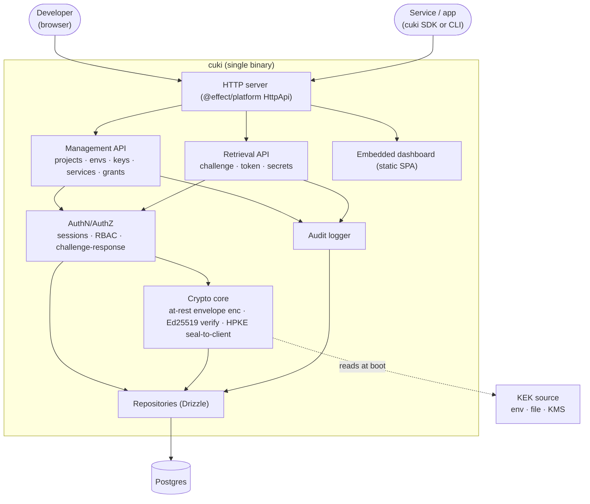

# 01 — Overview

## What cuki is

A self-hosted secrets and configuration store. Humans manage keys through a dashboard;
machines (services) retrieve the keys they've been granted through an authenticated API.
The whole thing ships as one binary that can also act as the client.

## Two planes

cuki exposes two logically distinct API planes over the same HTTP server. Keeping them
separate in your head prevents authorization bugs.

### Management plane (`/v1/...`, human/session auth)

Used by the dashboard and admin tooling. Authenticated with a **user session**
(cookie or bearer). Operates on the full hierarchy: organizations, memberships,
projects, environments, keys, services, grants, audit logs. Authorization is **RBAC**
(owner / admin / member / viewer) scoped to an organization.

### Retrieval plane (`/v1/auth/*`, `/v1/secrets`, service auth)

Used by services at runtime. Authenticated with an **Ed25519 challenge–response** that
yields a short-lived access token. A service can read only its **granted** keys, in its
own environment, and every read is audited. This plane has no write access to anything.

> The retrieval plane is the security-critical surface. It is intentionally tiny:
> three endpoints (`challenge`, `token`, `secrets`).

## Components



## Core write flow — a developer sets a sensitive key

```mermaid
sequenceDiagram
  participant U as Dashboard (user session)
  participant M as Management API
  participant C as Crypto core
  participant D as DB
  U->>M: PUT /v1/environments/:id/keys {name, type:sensitive, value}
  M->>M: authorize (RBAC: member+ on org)
  M->>C: encrypt(value)
  C->>C: DEK = random(32); ct = AEAD(DEK, value)
  C->>C: wrappedDEK = AEAD(KEK, DEK)
  C-->>M: {ct, nonce, wrappedDEK, dekNonce, kekVersion}
  M->>D: insert key + key_version (encrypted fields only)
  M->>D: append audit (actor=user, action=key.write)
  M-->>U: 200 {key metadata, no plaintext echoed}
```

Plaintext of a sensitive value exists only transiently in memory during this request and
during a decrypt-on-read. It is never persisted, never logged, never returned to the
dashboard after write.

## Core read flow — a service retrieves its secrets

```mermaid
sequenceDiagram
  participant S as Service (cuki client)
  participant R as Retrieval API
  participant C as Crypto core
  participant D as DB
  S->>R: POST /v1/auth/challenge {service_id}
  R->>D: load service, status=active?
  R->>D: store challenge {nonce, exp≈30s, single-use}
  R-->>S: {challenge_id, nonce, expires_at}
  S->>S: sig = Ed25519_sign(priv, "cuki-auth-v1"∥service_id∥nonce)
  S->>R: POST /v1/auth/token {challenge_id, signature}
  R->>D: load challenge (unexpired, unconsumed) + service pubkey
  R->>R: verify sig; mark challenge consumed
  R->>D: issue access_token {hash, scope=grants, exp≈10m}
  R-->>S: {access_token, expires_in}
  S->>R: GET /v1/secrets  (Bearer access_token)
  R->>D: resolve token → granted key ids
  R->>C: decrypt at-rest (KEK→DEK→plaintext)
  R->>C: HPKE seal batch to service's X25519 key
  R->>D: append audit (actor=service, action=secret.read, key_ids)
  R-->>S: {enc, ciphertext}  (sealed; opaque to anyone but this service)
  S->>S: HPKE open with derived X25519 private key → {keys:[{name,type,value}]}
  Note over S,R: token expires → repeat from challenge
```

Full detail of both auth mechanisms is in [`04-auth.md`](./04-auth.md).

## Trust boundaries & threat notes

- **DB compromise alone must not reveal sensitive values.** The DB holds only ciphertext
  and KEK-wrapped DEKs. Without the KEK (which lives outside the DB), sensitive keys are
  opaque. Public keys are plaintext by definition — do not put secrets in `public` keys.
- **DB compromise must not let an attacker impersonate a service.** Only Ed25519 public
  keys are stored; you cannot sign challenges with a public key.
- **A stolen access token has a small blast radius:** one environment's granted subset,
  for ≤ token TTL, revocable immediately. Not the whole vault, not forever. And on its own
  it still can't yield plaintext — retrieval responses are HPKE-sealed to the service's key,
  so plaintext also requires the service private key.
- **Values are unreadable in transit to anyone but the target service.** Each `/secrets`
  response is sealed to the requesting service's key (derived from its Ed25519 key),
  independent of TLS. Proxies, mirrored logs, and a compromised TLS endpoint see only
  ciphertext. cuki remains the custodian (it decrypts at rest and re-seals), so it handles
  plaintext transiently at delivery; a fully zero-knowledge variant is described in
  [`03`](./03-cryptography.md).
- **The KEK is the crown jewel.** If it leaks, all sensitive values are decryptable.
  Sourcing and rotation are covered in [`03-cryptography.md`](./03-cryptography.md).
- **Transport:** TLS is assumed in front of cuki (reverse proxy or built-in). The
  challenge–response defends against replay even without TLS, but values in transit
  require TLS — document this as a hard operational requirement.
