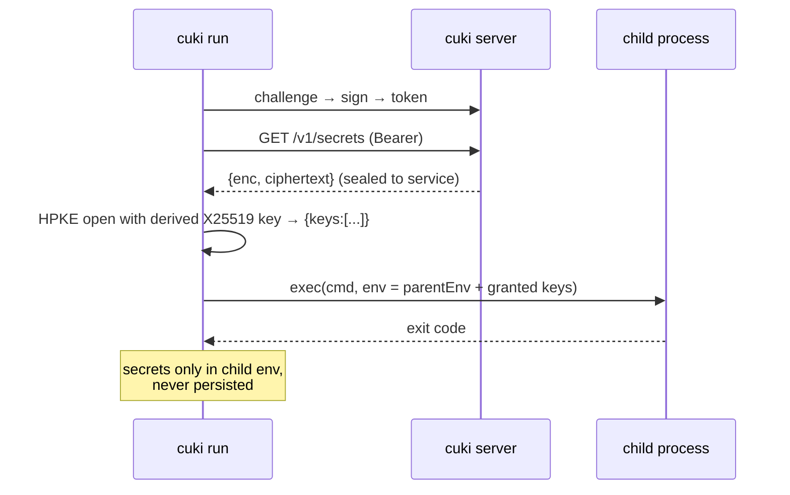

# 09 — Client SDK & CLI

The consumer side of the retrieval plane. The SDK performs the challenge–response, caches
the access token, refreshes it on expiry, and exposes `getSecret` / `getAll`. The CLI wraps
the SDK for shell use and process injection. Both are the same code, and both ship inside
the cuki binary (client subcommands) as well as a standalone npm package for apps.

## Credentials

A service is configured with:

- `CUKI_URL` — the cuki server base URL.
- `CUKI_SERVICE_ID` — the public service handle.
- `CUKI_PRIVATE_KEY` — the Ed25519 private key issued once at service creation (base64),
  or a path via `CUKI_PRIVATE_KEY_FILE`, or a `cuki.svc` credential file.

The private key never leaves the process; it's used only to sign challenge nonces.

## SDK

```ts
import { Cuki } from "cuki/client"

const cuki = Cuki.fromEnv()          // reads CUKI_URL / CUKI_SERVICE_ID / CUKI_PRIVATE_KEY
// or: Cuki.make({ url, serviceId, privateKey })

const dbUrl = await cuki.getSecret("DATABASE_URL")   // string
const all   = await cuki.getAll()                    // Record<string, string>
await cuki.intoEnv()                                 // assigns granted keys into process.env
```

An Effect-native surface is also exported for apps already on Effect:

```ts
import { CukiClient } from "cuki/client/effect"
const value = yield* CukiClient.getSecret("DATABASE_URL")   // Effect<string, CukiError, CukiClient>
```

### Auth handling (internal)

```
ensureToken():
  if cached token valid (with a small skew margin) → use it
  else:
    POST /v1/auth/challenge {service_id}          → {challenge_id, nonce, expires_at}
    msg = "cuki-auth-v1" ∥ 0x00 ∥ service_id ∥ 0x00 ∥ nonce
    sig = Ed25519_sign(privateKey, msg)
    POST /v1/auth/token {challenge_id, signature} → {access_token, expires_at}
    cache {token, expires_at}
```

- Cache the token in memory for its TTL; refresh proactively shortly before expiry.
- On `401` mid-flight (revoked/expired), drop the cache and re-auth once; if it fails
  again, surface a typed error.

### Decrypting responses (internal)

Retrieval responses are HPKE-sealed to the service; the SDK opens them locally — the
server's plaintext never touches the wire.

```
skR             = edwardsToMontgomeryPriv(privateKey)          # X25519 from the Ed25519 service key
{enc, ct, suite} = GET /v1/secrets  (Bearer token)
info            = "cuki-secrets-v1" ∥ 0x00 ∥ service_id
payload         = HPKE.OpenBase(enc, skR, info, aad, ct)
{ keys }        = JSON.parse(payload)                          # {name, type, value}[]
```

The derived X25519 key material and decrypted values stay in memory; nothing is written to
disk. `getSecret` / `getAll` / `intoEnv` are thin wrappers over this.
- Retries with jittered backoff on network/5xx (Effect `Schedule`); never retry a
  `bad_signature` / `revoked` — those are terminal.
- No secret values are cached to disk. Optional in-memory value cache with a short TTL for
  hot paths, off by default.

## CLI

Client subcommands of the cuki binary (or `npx cuki`):

```
cuki get DATABASE_URL                    # prints the value to stdout
cuki get --json                          # prints all granted keys as JSON
cuki env                                 # prints granted keys in dotenv format
cuki run -- node server.js               # injects granted keys as env vars, execs the process
cuki run --only DATABASE_URL,REDIS_URL -- ./app
```

`cuki run` is the primary DX pattern (à la doppler/infisical): it authenticates, fetches
the service's granted keys, sets them as environment variables of the child process, and
never writes them to disk. The child inherits stdio; cuki exits with the child's code.



## Config formats consumed

- `CUKI_*` env vars (containers/CI).
- `cuki.svc` credential file (downloaded from the dashboard at service creation): JSON with
  `url`, `service_id`, `private_key`. `cuki run --creds cuki.svc -- <cmd>`.
- Framework helpers can call `cuki.intoEnv()` at boot for in-process injection without the
  CLI wrapper.

## Errors (client)

Typed, tagged: `AuthFailed` (terminal — bad key/revoked), `Unauthorized` (retryable
re-auth), `NotFound` (unknown/ungranted key name), `Network`, `ServerError`. The CLI maps
these to clear messages and non-zero exit codes; `cuki run` fails fast before exec if it
can't fetch required keys, so a service never starts half-configured.

## Language coverage

Ship the TypeScript SDK first (in-binary + npm). The wire protocol is simple and built on
standards (HTTP + Ed25519 signatures + HPKE seal-to-recipient), so ports to Go/Python/Rust
are thin — every language has an HPKE and an Ed25519/X25519 library. Document the protocol
in this repo so third parties can implement clients.
